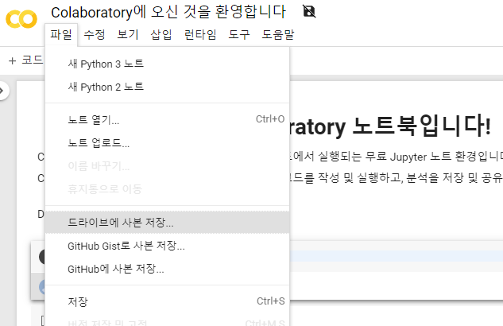
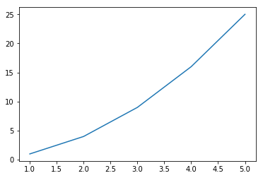
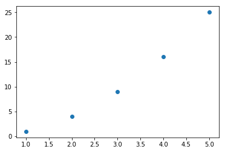
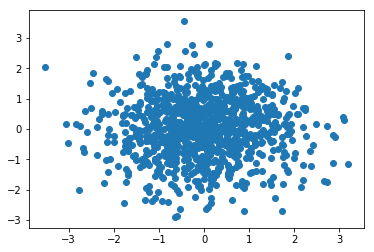

> `Do it! 정직하게 코딩하며 배우는 딥러닝 입문` 책 내용을 정리한 글입니다.<br>
> 수정해야 할 내용이 있거나 잘못된 내용이 있다면 알려주세요. 감사합니다.

<br>

## 02-1 구글 코랩(Colab)코랩이란?

---

 - 구글에서 교육 및 과학 연구를 목적으로 개발한 도구  
 - 2017년 무료 공개  
 - 웹 브라우저 상에서 파이썬 코드를 실행하거나 텍스트 작성, 그래프 그리기 등이 가능  
 - 코랩에서 만들어진 노트북 파일은 구글 드라이브에 저장, 파이썬 코드는 구글 드라이브에서 실행


#### 코랩 사용하기

1. 구글 계정으로 로그인

  - https://colab.research.google.com
  

2. 텍스트 셀 편집

  - 코랩 노트북은 2가지(텍스트 셀, 코드 셀)
  - 셀 수정은 마우스로 더블 클릭하거나, `Enter` 키를 통해 가능
  - 셀 수정 종료는 `ESC` 키
  - 텍스트 셀은 마크다운(Markdown) 문법으로 작성

3. 셀 추가
  - 셀 하단 경계선 중앙선에 마우스 커서를 옮기면 텍스트 셀 또는 코드 셀 추가 버튼 활성화
  - 코드 셀 추가 후, Python 코드를 입력한 다음 `Ctrl + Enter` 키 입력 또는 재생 버튼을 클릭하면 코드 실행


#### 코랩 노트북 관리


  - 코랩에서 작성한 노트북은 로그인한 구글 계정의 `구글 드라이브`에 저장
  - [파일] -> [드라이브에 사본 저장] 선택


  - 구글 드라이브에서 Colab 노트북 생성은 [마우스 우클릭] -> [Google Colaboratory] 선택


#### 코랩 노트북에서 자주 사용하는 기능

1. 셀 삭제
  - 셀 선택 후, `[Ctrl + M, D]` (M과 D키 동시에 입력)
2. 셀 실행 후 다음 셀로 이동
  - `[Shift + Enter]`, [Ctrl + Enter]는 선택된 셀만 실행(다음 셀로 이동 X)
3. 셀 실행 후 아래에 새 셀 생성
  - `[Alt + Enter]`

<br>

## 02-2 numpy 기초

---

#### Numpy(넘파이) 소개

  - 파이썬 과학 데이터 패키지 중 하나
  - 머신러닝/딥러닝 데이터를 다룰 때 널리 쓰임

#### Numpy 버전 확인
```python
import numpy as np
print(np.__version__)  # numpy 버전 확인
```

#### [결과]
```
1.16.5
```

#### Numpy와 Python 리스트의 차이

  - 파이썬으로 배열을 구현할 경우 배열 사이즈가 커질수록 성능이 떨어지지만, Numpy는 차원(배열 크기) 커져도 높은 성능 보장
  - 다양한 통계, 수학 내장함수 제공

#### Numpy array() 함수

```python
my_arr = np.array([[10, 20, 30], [40, 50 ,60]])  # numpy arrary 생성
print(my_arr)
```

#### [결과]
```
[[10 20 30]
[40 50 60]]
```
  - numpy에서는 `array()` 함수를 통해 배열 생성(numpy 객체)
  - 배열 요소에 접근하는 방법은 파이썬 리스트와 동일

#### Numpy 내장함수

```python
np.sum(my_arr) # numpy 내장함수 sum()을 이용한 요소 합 구하기
```

  - numpy sum() 함수의 경우 for문 보다 속도가 빠름
  - 기타 numpy 내장함수(https://docs.scipy.org/doc/numpy/reference/)

#### Matplotlib 기초

  - 파이썬 데이터 시각화 라이브러리
  - 다양한 그래프를 그릴 수 있음
  - Numpy와 함께 자주 사용

#### 선 그래프 그리기
```python
import numpy as np
import matplotlib.pyplot as plt

plt.plot([1, 2, 3, 4, 5], [1, 4, 9, 16, 25]) # x축, y축 값을 리스트 형태로 전달
plt.show()  # 그래프를 그려줌
```

#### [결과]


#### 산점도 그래프 그리기 1

```python
plt.scatter([1, 2, 3, 4, 5], [1, 4, 9, 16, 25])  # scatter()함수에 x축, y축 정보를 리스트로 전달하여 산점도 그래프 표현
plt.show()
```

#### [결과]



#### 산점도 그래프 그리기 2

```python
x = np.random.randn(1000) # numpy random 함수를 이용하여 x축, y축 데이터를 임의로 생성
y = np.random.randn(1000)
plt.scatter(x, y)
plt.show()
```

#### [결과]


<br>

---

#### [Reference]

[1] [Do it! 딥러닝 입문(박해선)](http://www.kyobobook.co.kr/product/detailViewKor.laf?ejkGb=KOR&mallGb=KOR&barcode=9791163031093&orderClick=LAG&Kc=), p.28~44
